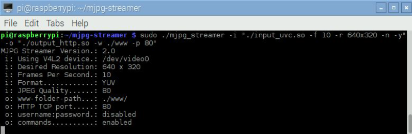

# Purpose:
This project controls two home appliances using a app designed in MIT app inventor. The commands sent through the app go through the Thingspeak server to the NodeMCU at home and turn the appliance ON or OFF. 
We also connected a Rasperrypi camera to a Raspberrypi 3B+ module for live streaming on a free server. The setup steps are shown below.
## Raspberrypi setup:
Please first make sure that the latest updates are installed on your Pi. To update your Pi run
the two commands below.
```
sudo apt-get install update
sudo apt-get install upgrade
```
### Install MJPG-streamer Dependencies:
This project requires the presence of libjpeg-dev, imagemagick, libv4l-dev. Install them as
follows:
```
sudo apt-get install libjpeg8-dev imagemagick libv4l-dev
```
### Build MJPG-streamer
The MJPG-streamer application doesn't come in a package form that we can install
using sudo apt-get install command. Instead, what we have to do is to download and compile
it from source code.
Source code usually comes in the form of a "tarball" i.e. multiple files packed together into
an archive using the tar utility and then compressed using gzip utility to reduce the size of the
archive.
Download MJPG-streamer tarball using the command below:
```
wget http://terzo.acmesystems.it/download/webcam/mjpg-streamer.tar.gz
```
Unpack the tarball as follows:
```
tar -xvzf mjpg-streamer.tar.gz
```
Make a symlink between two libraries that will be used to compile MJPG-streamer:
```
sudo ln -s /usr/include/libv4l1-videodev.h /usr/include/linux/videodev.h
```
Navigate into MJPG-streamer directory and edit Makefile using your favourite editor:
```
cd mjpg-streamer
nano Makefile
```
In this file, comment out the input_gspcav1 plugin by inserting " # " at the beginning of the
line, like so:
```
# PLUGINS += input_gspcav1.so
```
Finally, run make to compile the program.
Compilation should only take couple of seconds and should produce no errors. When
successful we'll have an MJPG-streamer application executable built.
### Run MJPG-streamer Server
The command below will run the server:
```
sudo ./mjpg_streamer -i "./input_uvc.so -f 10 -r 640x320 -n -y" -o "./output_http.so -w ./
www -p 80
```


If you see an output similar to the one in the picture it means that the server is running
correctly:
